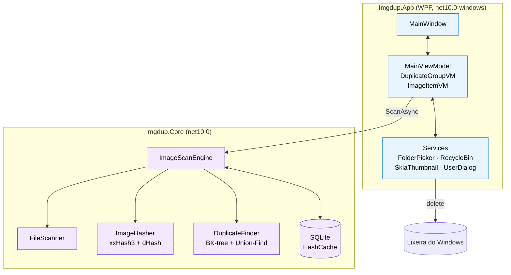
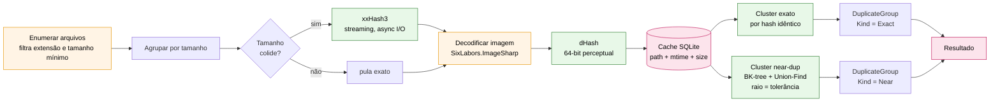
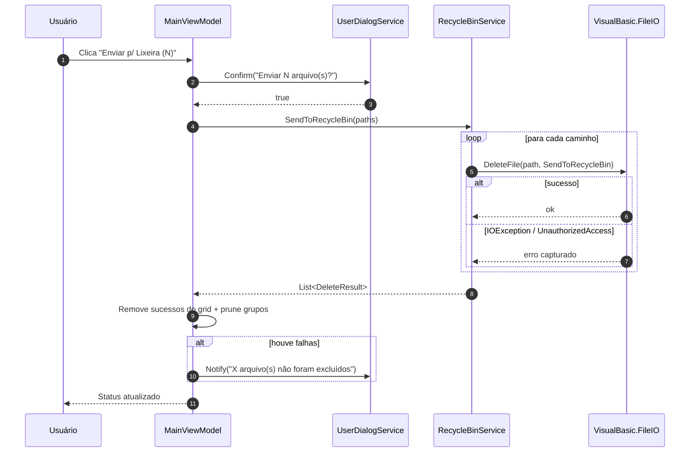

<div align="center">

# Imgdup

**Verificador de imagens duplicadas para Windows.**
Detecta cópias byte-idênticas e visualmente similares em uma ou mais pastas,
exibe os grupos em uma galeria virtualizada e envia as selecionadas para a Lixeira.

[](https://dotnet.microsoft.com/)
[](https://learn.microsoft.com/dotnet/csharp/)
[](#plataforma-suportada)
[](LICENSE)

</div>

---

## Sumário

- [Funcionalidades](#funcionalidades)
- [Plataforma suportada](#plataforma-suportada)
- [Como usar](#como-usar)
- [Como executar](#como-executar)
- [Arquitetura](#arquitetura)
- [Pipeline de detecção](#pipeline-de-detecção)
- [Fluxo de exclusão para a Lixeira](#fluxo-de-exclusão-para-a-lixeira)
- [Stack](#stack)
- [Estrutura do projeto](#estrutura-do-projeto)
- [Testes](#testes)
- [Licença](#licença)

---

## Funcionalidades

- Seleção de **uma ou mais pastas** via diálogo nativo, com opção de incluir subpastas.
- Detecção de **duplicatas exatas** (byte a byte) usando `xxHash3`.
- Detecção de **imagens visualmente similares** (perceptual) usando `dHash` com tolerância de Hamming ajustável (0–16).
- **Cache em SQLite** indexado por `caminho + data de modificação + tamanho` — re-scans não redecodificam arquivos inalterados.
- **Galeria virtualizada e agrupada** por cluster de duplicatas, escalando para coleções grandes.
- Três modos de visualização: **Pequeno (96 px), Médio (160 px), Grande (256 px)**.
- Ordenação por **data, tamanho ou nome** (ascendente ou descendente).
- Sugestão automática de "manter" por grupo (maior resolução, depois mais antiga), destacada na UI.
- Seleção múltipla, com atalho **"Selecionar extras"** (marca todos exceto o sugerido a manter).
- **Exclusão para a Lixeira do Windows** — recuperável, nunca permanente.
- Tratamento explícito de falhas: arquivos acima de 2 GB, em rede ou em uso são reportados, não silenciosamente ignorados.
- Cancelamento de scan em andamento.
- Pipeline paralelo (`Parallel.ForEachAsync`) saturando todos os núcleos disponíveis.
- Awareness de DPI **PerMonitorV2** e suporte a caminhos longos.

## Plataforma suportada

| Item | Suporte |
|------|---------|
| Sistema operacional | **Windows 10 e Windows 11 (x64)** |
| Runtime | .NET 10.0 (LTS) |
| Formatos de imagem | `.jpg`, `.jpeg`, `.png`, `.bmp`, `.gif`, `.webp`, `.tiff`, `.tif` |

> O projeto `Imgdup.Core` é multiplataforma (`net10.0`) e seus testes rodam em Windows, Linux e macOS.
> A interface gráfica (`Imgdup.App`) é WPF e executa apenas no Windows.

---

## Como usar

1. **Adicionar pastas** — clique em *Adicionar pastas…* e selecione uma ou mais. Marque *Subpastas* se quiser varredura recursiva.
2. **Configurar similaridade** — marque *Similares (perceptual)* para incluir imagens visualmente parecidas e ajuste a *Tolerância* (menor = mais estrito).
3. **Verificar** — clique em *Verificar*. O progresso aparece na barra inferior; *Cancelar* interrompe.
4. **Revisar grupos** — cada grupo mostra a sugestão de "manter" destacada em verde no canto.
5. **Selecionar** arquivos manualmente ou usar *Selecionar extras* para marcar todos os sugeridos para exclusão de uma vez.
6. **Enviar p/ Lixeira** — confirma e remove. Arquivos vão para a Lixeira do Windows e podem ser restaurados de lá.

---

## Como executar

### Pré-requisitos

- **Windows 10 ou 11** (x64)
- **.NET 10 SDK** — [download oficial](https://dotnet.microsoft.com/download/dotnet/10.0)
- **Git** (somente para clonar)

Verificar o SDK:

```powershell
dotnet --list-sdks
# deve listar uma versão começando com 10.0
```

### Clonar e executar

```powershell
git clone https://github.com/<usuario>/Imgdup.git
cd Imgdup
dotnet run -c Release --project src/Imgdup.App
```

A primeira execução baixa as dependências NuGet (~ 30 s).

### Gerar executável publicado (single-file)

Para distribuir um `.exe` independente, com o runtime embutido:

```powershell
dotnet publish src/Imgdup.App `
  -c Release `
  -r win-x64 `
  --self-contained true `
  -p:PublishSingleFile=true
```

Saída: `src/Imgdup.App/bin/Release/net10.0-windows/win-x64/publish/Imgdup.App.exe`.

### Onde fica o cache

```
%LOCALAPPDATA%\Imgdup\hashes.db
```

Apagar este arquivo força a redecodificação completa no próximo scan.

---

## Arquitetura

Dois projetos com fronteira clara: **engine sem dependência de UI** (`Imgdup.Core`) e **app WPF** (`Imgdup.App`). Toda interação com o usuário, sistema de arquivos sensível ao Windows e renderização vive na camada de aplicação. O motor é puro `net10.0` e totalmente testável.



---

## Pipeline de detecção

O motor é otimizado para evitar trabalho desnecessário. **Hash exato** só roda em arquivos com tamanho colidente (byte-idênticos têm o mesmo tamanho). **Hash perceptual** decodifica cada imagem uma única vez. O agrupamento near-dup usa **BK-tree** sobre distância de Hamming, reduzindo O(n²) para ≈ O(n·log n).



Toda a etapa de hashing (do nó *xxHash3* ao *dHash*) executa em paralelo com `Parallel.ForEachAsync`, limitado a `Environment.ProcessorCount`. Progresso e cancelamento são propagados via `IProgress<ScanProgress>` e `CancellationToken`.

---

## Fluxo de exclusão para a Lixeira

Exclusão sempre é reversível pelo usuário através da Lixeira nativa. Falhas conhecidas do Windows (arquivos > 2 GB, caminhos de rede, arquivos em uso) são reportadas de forma explícita, item por item.



---

## Stack

| Camada | Tecnologia | Por quê |
|--------|-----------|---------|
| Runtime | **.NET 10 LTS** / C# 14 | Suporte até nov/2028, sem GIL, paralelismo real |
| UI | **WPF** + CommunityToolkit.Mvvm | Janela nativa Windows, MVVM com source generators |
| Galeria virtualizada | **VirtualizingWrapPanel** | Recycling de containers, grouping nativo |
| Decode de thumbnail | **SkiaSharp** | Resize hardware-friendly, rápido |
| Hash perceptual | **CoenM.ImageHash** (dHash) | Robusto a escala, brilho, aspect ratio |
| Hash exato | **System.IO.Hashing** (xxHash3) | Non-crypto, streaming, ordens de magnitude mais rápido que SHA |
| Índice near-dup | BK-tree + Union-Find (custom) | Busca por raio de Hamming em ≈ O(log n) |
| Cache | **Microsoft.Data.Sqlite** | Re-scan incremental, WAL habilitado |
| Lixeira | **Microsoft.VisualBasic.FileIO** | Único caminho gerenciado para `SHFileOperation` com Recycle Bin |

**Pinned for security:** `SixLabors.ImageSharp` está fixado em `3.1.12` para cobrir as advisories [GHSA-2cmq-823j-5qj8](https://github.com/advisories/GHSA-2cmq-823j-5qj8) e [GHSA-rxmq-m78w-7wmc](https://github.com/advisories/GHSA-rxmq-m78w-7wmc).
NuGet audit está habilitado e `warnings-as-errors` falha o build se uma nova CVE for publicada.

---

## Estrutura do projeto

```
Imgdup/
├── Imgdup.slnx                       # Solução (formato .slnx, novo .NET 10)
├── Directory.Build.props             # LangVersion, Nullable, warnings-as-errors, analyzers
├── Directory.Packages.props          # Central Package Management (versões centralizadas)
├── LICENSE                           # MIT
├── README.md
│
├── src/
│   ├── Imgdup.Core/                  # Motor — net10.0, sem UI
│   │   ├── Models/                   # PerceptualHash, ImageEntry, DuplicateGroup,
│   │   │                             #   ScanOptions, ScanProgress
│   │   ├── Hashing/                  # IImageHasher, ImageHasher (xxHash3 + dHash)
│   │   ├── Dedup/                    # BkTree, UnionFind, DuplicateFinder
│   │   ├── Scanning/                 # FileScanner, ImageScanEngine
│   │   └── Caching/                  # IHashCache, SqliteHashCache
│   │
│   └── Imgdup.App/                   # WPF — net10.0-windows
│       ├── App.xaml(.cs)             # Composition root + handler global de exceção
│       ├── MainWindow.xaml(.cs)      # Toolbar + galeria virtualizada
│       ├── app.manifest              # DPI PerMonitorV2 + long path aware
│       ├── ViewModels/               # MainViewModel, DuplicateGroupVM, ImageItemVM
│       ├── Services/                 # FolderPicker, RecycleBin, SkiaThumbnail, UserDialog
│       └── Converters/               # EnumEquals, MatchKindToBrush
│
└── tests/
    └── Imgdup.Core.Tests/            # xUnit — BkTree, DuplicateFinder, PerceptualHash
```

---

## Testes

O motor é coberto por testes unitários que rodam em qualquer plataforma:

```powershell
dotnet test tests/Imgdup.Core.Tests
```

Cobertura atual:

| Componente | O que é validado |
|------------|------------------|
| `PerceptualHash` | Distância de Hamming, similaridade, casos limite (0 e 64 bits) |
| `BkTree` | Query por raio, raio zero (exato), árvore vazia |
| `DuplicateFinder` | Agrupamento exato, clustering near-dup, ranking "manter", entrada sem duplicatas |

---

## Licença

Distribuído sob a [Licença MIT](LICENSE) — © 2026 Jeferson Reis Almeida.
